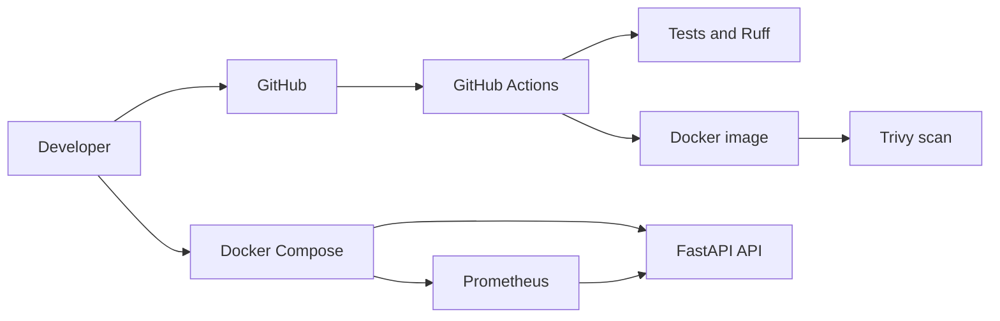

# CI/CD Kubernetes Project

A production-minded DevOps portfolio project built around a small FastAPI service. The project demonstrates how application code moves through automated quality checks, containerization, security scanning, observability, and eventually Kubernetes deployment.

The application is intentionally small. The focus is the delivery platform and the operational decisions around it.

## Current Status

Implemented:

- FastAPI HTTP service
- Liveness-style health endpoint at `/healthz`
- Prometheus metrics at `/metrics`
- Request count and latency instrumentation
- Docker image build
- Local Docker Compose environment with Prometheus
- Pytest API tests
- Ruff linting and formatting checks
- GitHub Actions CI
- Trivy container vulnerability scanning
- Separate runtime and development dependencies
- Helm chart with Kubernetes health probes and optional ServiceMonitor

Planned next:

- Kubernetes Deployment and Service manifests
- Helm chart
- Local Kubernetes deployment with kind or k3d
- Readiness and liveness probes in Kubernetes
- Grafana dashboards and alert rules
- Container hardening and non-root execution
- Image publishing and release automation
- Terraform-managed cloud infrastructure

## Architecture



## Repository Structure

```text
.
├── .github/workflows/ci.yml       # GitHub Actions CI pipeline
├── app/
│   ├── __init__.py
│   ├── main.py                    # FastAPI app and metrics middleware
│   └── prometheus/prometheus.yml  # Prometheus scrape configuration
├── api-helm/                       # Kubernetes deployment chart
│   ├── Chart.yaml
│   ├── values.yaml
│   └── templates/
├── tests/test_main.py             # API tests
├── Dockerfile                     # Runtime container image
├── docker-compose.yml             # Local API, Prometheus, and Grafana stack
├── requirements.txt               # Runtime dependencies only
├── requirements-dev.txt           # Runtime plus test and lint dependencies
├── .env.example                   # Local environment variable template
└── pytest.ini                     # Pytest discovery and import configuration
```

## Prerequisites

Install the following tools:

- Python 3.12 or newer
- Docker Engine and Docker Compose
- Git

GitHub Actions uses Python 3.12 to match the Python version used by the Docker image.

## Local Development

Create a virtual environment and install development dependencies:

```bash
python3 -m venv .venv
.venv/bin/python -m pip install --upgrade pip
.venv/bin/python -m pip install -r requirements-dev.txt
```

Run the API locally:

```bash
.venv/bin/uvicorn app.main:app --reload
```

The API is then available at:

- http://localhost:8000/
- http://localhost:8000/healthz
- http://localhost:8000/metrics
- http://localhost:8000/docs

## Quality Checks

Run the same checks locally that run in CI:

```bash
.venv/bin/ruff check .
.venv/bin/ruff format --check .
.venv/bin/pytest -q
```

The test suite currently covers the root endpoint, health endpoint, and metrics endpoint.

## Docker

Build the runtime image:

```bash
docker build --tag cicd-api:local .
```

Run it:

```bash
docker run --rm --publish 8000:8000 cicd-api:local
```

The Dockerfile installs only `requirements.txt`. Test and lint tools are deliberately excluded from the production image to reduce image size.

## Docker Compose, Prometheus, and Grafana

Start the local stack:

```bash
docker compose up --build
```

Services:

- API: http://localhost:8000
- Prometheus: http://localhost:9090
- Grafana: http://localhost:3000

Prometheus scrapes the API every 15 seconds using the configuration in `app/prometheus/prometheus.yml`.
Grafana is provisioned with Prometheus as its default datasource. Configure local credentials before starting the stack:

```bash
cp .env.example .env
```

Edit `.env` and replace the example password. Log in using the values from that file. `.env` is ignored by Git and must never contain production credentials in a committed change.

Stop the stack:

```bash
docker compose down
```

## CI Pipeline

The workflow is defined in `.github/workflows/ci.yml`. It runs for pull requests and pushes to `main`.

Pipeline stages:

1. Check out the repository.
2. Set up Python 3.12.
3. Install `requirements-dev.txt`.
4. Run Ruff lint checks.
5. Verify formatting with Ruff.
6. Run the test suite.
7. Build the Docker image.
8. Scan the image with Trivy.
9. Lint and render the Helm chart.

The image is tagged with the commit SHA:

```yaml
docker build --tag cicd-api:${{ github.sha }} .
```

The same tag is passed to Trivy. This ensures that the scanner checks the exact image built by that workflow run instead of an ambiguous tag such as `latest`.

The workflow uses:

```yaml
permissions:
  contents: read
```

This follows least privilege because the current pipeline only reads the repository. Future publishing or cloud deployment jobs should receive additional permissions only at the job level when required.

## Security Decisions

### Dependency separation

`requirements.txt` contains packages required to run the application. `requirements-dev.txt` includes those packages plus pytest, httpx, and Ruff. This keeps development tooling out of the production image and reduces its attack surface.

### Dependency pinning

Application dependencies are pinned to known versions. This makes local, CI, and container builds more reproducible and allows vulnerability findings to be traced to a specific installed version.

### Vulnerability gate

Trivy scans operating system and Python dependencies. The workflow fails for HIGH or CRITICAL vulnerabilities when a fixed version is available:

```yaml
severity: CRITICAL,HIGH
exit-code: "1"
ignore-unfixed: true
```

`ignore-unfixed: true` prevents the pipeline from failing on vulnerabilities for which no upstream fix exists. This should be reviewed deliberately rather than treated as a permanent exception.

### Immutable image identity

Commit SHA tags make images traceable to source code. The SHA tag is preferable for deployment automation because it does not silently move to different source code.

## Observability

The application exposes Prometheus metrics through `/metrics` and records:

- Total HTTP requests, labelled by method, endpoint, and status
- Request latency, labelled by method and endpoint

This provides the foundation for service-level indicators such as request rate, error rate, and latency. The next observability milestone is adding Grafana dashboards and alert rules.

## Kubernetes Deployment

The API chart is in `api-helm/`. It packages the Kubernetes configuration while the Dockerfile continues to package the application.

The chart provides:

- Deployment with two replicas
- Service
- Readiness probe using `/healthz`
- Liveness probe using `/healthz`
- Resource requests and limits
- Optional HorizontalPodAutoscaler
- Optional ServiceMonitor for Prometheus Operator

Lint and render the chart locally:

```bash
helm lint api-helm
helm template api-release api-helm --set image.tag=<commit-sha>
```

Enable metrics scraping when `kube-prometheus-stack` is installed:

```bash
helm upgrade --install api-release api-helm \
  --set image.tag=<commit-sha> \
  --set serviceMonitor.enabled=true
```

The ServiceMonitor requires the Prometheus Operator CRDs. With a Prometheus setup that does not use the operator, configure Prometheus to discover the API Service directly instead.

Next deployment milestones are a local kind or k3d cluster, NetworkPolicy, and a GitOps or release workflow.

A future deployment flow will build and scan an image in CI, publish it with an immutable commit tag, and deploy that tag through Helm or GitOps.

## Design Goals

This project is designed to demonstrate the following DevOps practices:

- Repeatable builds
- Automated quality gates
- Secure dependency and image handling
- Separation of build-time and runtime concerns
- Observable services
- Immutable artifacts
- Least-privilege automation
- Health-aware deployments
- Documented operational decisions

The application is deliberately not a large product. A small service makes it easier to demonstrate the delivery lifecycle, failure modes, security controls, and rollback strategy clearly.

## Useful Commands

```bash
# Run tests
.venv/bin/pytest -q

# Lint
.venv/bin/ruff check .

# Check formatting
.venv/bin/ruff format --check .

# Build the image
docker build --tag cicd-api:local .

# Start API and Prometheus
docker compose up --build

# Stop local services
docker compose down
```

## Portfolio Demonstration

A useful interview demonstration is:

1. Open a pull request with a code change.
2. Show Ruff and pytest running in GitHub Actions.
3. Show the Docker image being built with the commit SHA.
4. Show Trivy blocking a vulnerable dependency.
5. Update the dependency and rerun the pipeline successfully.
6. Show Prometheus scraping `/metrics` locally.
7. Deploy the same immutable image to Kubernetes as the next project milestone.
