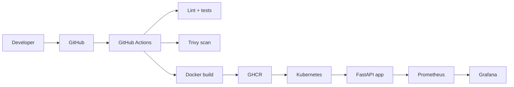

# CI/CD Kubernetes Portfolio Project

This project is a small but realistic DevOps portfolio application built around a FastAPI service. The goal is to demonstrate the full delivery lifecycle: code quality checks, Docker packaging, security scanning, GitHub Actions automation, registry publishing, and Helm-based deployment patterns.

The app itself is intentionally simple. The real value is the delivery platform and operational decisions around it.

## Current status

The project includes:

- FastAPI app with health and metrics endpoints
- Prometheus instrumentation for request count and latency
- Docker image build
- Local Docker Compose stack with API, Prometheus, and Grafana
- Pytest coverage for the main API endpoints
- Ruff linting and formatting checks
- GitHub Actions CI for validation on `dev` and `main`
- Trivy vulnerability scanning for the container image
- GHCR publishing for dev preview images and main release artifacts
- Helm chart packaging for Kubernetes deployments
- Branch-based release flow with dev and main environments in mind

Planned next steps:

- Deploy to a local Kubernetes cluster using kind or k3d
- Deploy the GHCR image through Helm into a dev cluster
- Add production-style environment values and secrets handling
- Add further cloud and Azure automation later

## Why this project matters

This repo demonstrates:

- code validation in CI
- security scanning before deployment
- container packaging
- image registry publishing
- environment branching strategy
- Kubernetes deployment templating with Helm
- Observability with Prometheus and Grafana

## Architecture overview


```mermaid
flowchart LR
    Dev[Developer] --> GitHub[GitHub]
    GitHub --> CI[GitHub Actions]
    CI --> Lint[Lint + tests]
    CI --> Scan[Trivy scan]
    CI --> Docker[Docker build]
    Docker --> GHCR[GHCR]
    GHCR --> K8s[Kubernetes]
    K8s --> App[FastAPI app]
    App --> Prometheus[Prometheus]
    Prometheus --> Grafana[Grafana]
```

## Repository structure

```text
.
├── .github/
│   └── workflows/
│       └── ci.yml                 # CI workflow for dev/main branches
├── app/
│   ├── __init__.py
│   ├── main.py                    # FastAPI app and metrics middleware
│   └── prometheus/
│       └── prometheus.yml         # Prometheus scrape configuration
├── api-helm/                      # Helm chart for Kubernetes deployment
│   ├── Chart.yaml
│   ├── values.yaml
│   └── templates/
├── tests/
│   └── test_main.py               # API tests
├── .env.example                   # Local example environment file
├── .gitignore
├── Dockerfile                     # Runtime image definition
├── docker-compose.yml             # Local API + monitoring stack
├── pytest.ini                     # Pytest configuration
├── README.md                      # Project documentation
├── requirements.txt               # Runtime dependencies
├── requirements-dev.txt            # Dev/test/lint dependencies
└── k8s/                           # Kubernetes-related notes and future deployment config
```

## Prerequisites

Install the following tools locally:

- Python 3.12+
- Docker Engine
- Docker Compose
- Git
- Helm (for chart validation and local template rendering)

The project intentionally uses Python 3.12 to match the runtime image and CI environment.

## Local development

Create and activate a virtual environment:

```bash
python3 -m venv .venv
source .venv/bin/activate
python -m pip install --upgrade pip
python -m pip install -r requirements-dev.txt
```

Run the app locally:

```bash
uvicorn app.main:app --reload
```

Available routes:

- http://localhost:8000/
- http://localhost:8000/healthz
- http://localhost:8000/metrics
- http://localhost:8000/docs

Run the project checks locally:

```bash
ruff check .
ruff format --check .
pytest -q
```

## Docker

Build the image:

```bash
docker build --tag cicd-api:local .
```

Run the image locally:

```bash
docker run --rm -p 8000:8000 cicd-api:local
```

This image intentionally contains only the runtime dependencies needed for the application. Lint and test tooling live in `requirements-dev.txt` and are not part of the runtime image.

## Local observability with Docker Compose

Start the full local stack:

```bash
docker compose up --build
```

Services:

- FastAPI app: http://localhost:8000
- Prometheus: http://localhost:9090
- Grafana: http://localhost:3000

The stack uses the Prometheus configuration in `app/prometheus/prometheus.yml` and a Grafana datasource provisioned for Prometheus.

Create a local `.env` file from the example file:

```bash
cp .env.example .env
```

Then update secrets or local values as needed. Do not commit production credentials.

Stop the stack:

```bash
docker compose down
```

## GitHub Actions CI workflow

The workflow is defined in `.github/workflows/ci.yml` and is set up for both `dev` and `main` branches.

### Build and validation job

On both branches, the workflow runs:

1. checkout repository
2. set up Python 3.12
3. install dev dependencies
4. run Ruff lint checks
5. run Ruff format checks
6. run pytest
7. build the Docker image
8. scan the image with Trivy
9. lint and template the Helm chart

### Publish job

The publish job runs on pushes to `dev` and `main` and does the following:

- `dev` branch:
  - builds the app image
  - pushes a `:dev` image to GHCR for preview testing
- `main` branch:
  - builds the release image
  - pushes the image to GHCR using the commit SHA tag
  - packages the Helm chart
  - pushes the chart to GHCR as an OCI artifact

## Security and quality decisions

### Dependency separation

The app uses:

- `requirements.txt` for runtime dependencies
- `requirements-dev.txt` for dev, lint, and test dependencies

This keeps the runtime image smaller and reduces the attack surface.

### Dependency pinning

Dependencies are pinned to known versions to keep builds reproducible and easy to debug. This makes vulnerability findings easier to trace to the exact installed version.

### Trivy security gate

The pipeline fails if Trivy finds HIGH or CRITICAL vulnerabilities that have a fix available. This is a good default for a portfolio project because it demonstrates security hygiene without introducing noisy false positives.

### Base image refresh

The Dockerfile refreshes Debian packages before installing Python app dependencies. This addresses base-image vulnerabilities such as stale OS libraries found by Trivy.

## Helm deployment pattern

The chart under `api-helm/` is designed to package the app for Kubernetes. The chart is used to define reusable deployment values and templates rather than creating a one-off custom deployment every time.

It includes:

- Deployment
- Service
- health/readiness probes
- resource requests and limits
- configurable image values
- structure ready for future environment overlays

Typical usage:

```bash
helm lint api-helm
helm template api-release api-helm --set image.tag=dev
```

For a real deployment, you would point the chart to a registry image such as:

```bash
ghcr.io/<your-user>/cicd-api:dev
```

or the commit SHA tag on `main`.

## Why Helm matters

Helm is not what runs the container. Kubernetes does that.

Helm makes Kubernetes deployments more robust and repeatable by giving you:

- value-driven configuration
- environment-specific overlays
- versioned deployment artifacts
- easier rollback and upgrades
- cleaner operational workflows

In other words, the image is the app artifact, Kubernetes runs the app, and Helm helps manage the deployment configuration.

## Observability

The application exposes Prometheus-compatible metrics at `/metrics` and emits:

- total request count by method, path, and status
- request latency by method and endpoint

This gives a basic foundation for service monitoring and later dashboarding in Grafana.

## Roadmap

Next practical milestones in this project:

1. deploy to local Kubernetes with kind or k3d
2. deploy the GHCR image via Helm
3. test dev cluster behavior before merging to main
4. add richer environment values and secrets management
5. expand the application and chart to support a more production-like setup

## Design Goals

This project is designed to demonstrate the following DevOps practices:

- Repeatable builds
- Automated quality gates
- Secure dependency and image handling
- Separation of build-time and runtime concerns
- Observable services
- Immutable artifacts
- Least-privilege automation
- Health-aware deployments
- Documented operational decisions

The application is deliberately not a large product. A small service makes it easier to demonstrate the delivery lifecycle, failure modes, security controls, and rollback strategy clearly.

## Useful Commands

```bash
# Run tests
.venv/bin/pytest -q

# Lint
.venv/bin/ruff check .

# Check formatting
.venv/bin/ruff format --check .

# Build the image
docker build --tag cicd-api:local .

# Start API and Prometheus
docker compose up --build

# Stop local services
docker compose down
```

## Portfolio Demonstration

1. Open a pull request with a code change.
2. Show Ruff and pytest running in GitHub Actions.
3. Show the Docker image being built with the commit SHA.
4. Show Trivy blocking a vulnerable dependency.
5. Update the dependency and rerun the pipeline successfully.
6. Show Prometheus scraping `/metrics` locally.
