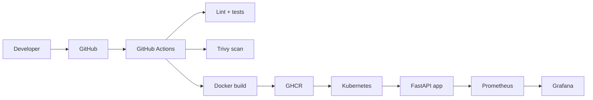

# CI/CD Kubernetes Portfolio Project

This project is a small but realistic DevOps portfolio application built around a FastAPI service. The goal is to demonstrate the full delivery lifecycle: code quality checks, Docker packaging, security scanning, GitHub Actions automation, registry publishing, and Helm-based deployment patterns.

The app itself is intentionally simple. The real value is the delivery platform and operational decisions around it.

## Current status

The project includes:

- FastAPI app with health and metrics endpoints
- Prometheus instrumentation for request count and latency
- Docker image build
- Local Docker Compose stack with API, Prometheus, and Grafana
- Pytest coverage for the main API endpoints
- Ruff linting and formatting checks
- GitHub Actions CI for validation and publishing from `main`
- Trivy vulnerability scanning for the container image
- GHCR publishing of immutable commit-SHA images from `main`
- Helm chart packaging for Kubernetes deployments
- GitOps deployment of the `main` release to the production namespace

Planned next steps:

- Deploy to a local Kubernetes cluster using kind or k3d
- Manage AKS and bootstrap Argo CD with Terraform
- Deploy the production image through Argo CD from Git
- Add production-style environment values and secrets handling
- Add further cloud and Azure automation later

## Why this project matters

This repo demonstrates:

- code validation in CI
- security scanning before deployment
- container packaging
- image registry publishing
- environment branching strategy
- Kubernetes deployment templating with Helm
- Observability with Prometheus and Grafana

## Architecture overview


```mermaid
flowchart LR
    Dev[Developer] --> GitHub[GitHub]
    GitHub --> CI[GitHub Actions]
    CI --> Lint[Lint + tests]
    CI --> Scan[Trivy scan]
    CI --> Docker[Docker build]
    Docker --> GHCR[GHCR]
    GHCR --> K8s[Kubernetes]
    K8s --> App[FastAPI app]
    App --> Prometheus[Prometheus]
    Prometheus --> Grafana[Grafana]
```

## Repository structure

```text
.
├── .github/
│   └── workflows/
│       └── ci.yml                 # CI and main-branch image publishing
├── app/
│   ├── __init__.py
│   ├── main.py                    # FastAPI app and metrics middleware
│   └── prometheus/
│       └── prometheus.yml         # Prometheus scrape configuration
├── api-helm/                      # Helm chart for Kubernetes deployment
│   ├── Chart.yaml
│   ├── values.yaml
│   └── templates/
├── tests/
│   └── test_main.py               # API tests
├── .env.example                   # Local example environment file
├── .gitignore
├── Dockerfile                     # Runtime image definition
├── docker-compose.yml             # Local API + monitoring stack
├── pytest.ini                     # Pytest configuration
├── README.md                      # Project documentation
├── requirements.txt               # Runtime dependencies
├── requirements-dev.txt            # Dev/test/lint dependencies
└── k8s/                           # Kubernetes-related notes and future deployment config
```

## Prerequisites

Install the following tools locally:

- Python 3.12+
- Docker Engine
- Docker Compose
- Git
- Helm (for chart validation and local template rendering)

The project intentionally uses Python 3.12 to match the runtime image and CI environment.

## Local development

Create and activate a virtual environment:

```bash
python3 -m venv .venv
source .venv/bin/activate
python -m pip install --upgrade pip
python -m pip install -r requirements-dev.txt
```

Run the app locally:

```bash
uvicorn app.main:app --reload
```

Available routes:

- http://localhost:8000/
- http://localhost:8000/healthz
- http://localhost:8000/metrics
- http://localhost:8000/docs

Run the project checks locally:

```bash
ruff check .
ruff format --check .
pytest -q
```

## Docker

Build the image:

```bash
docker build --tag cicd-api:local .
```

Run the image locally:

```bash
docker run --rm -p 8000:8000 cicd-api:local
```

This image intentionally contains only the runtime dependencies needed for the application. Lint and test tooling live in `requirements-dev.txt` and are not part of the runtime image.

## Local observability with Docker Compose

Start the full local stack:

```bash
docker compose up --build
```

Services:

- FastAPI app: http://localhost:8000
- Prometheus: http://localhost:9090
- Grafana: http://localhost:3000

The stack uses the Prometheus configuration in `app/prometheus/prometheus.yml` and a Grafana datasource provisioned for Prometheus.

Create a local `.env` file from the example file:

```bash
cp .env.example .env
```

Then update secrets or local values as needed. Do not commit production credentials.

Stop the stack:

```bash
docker compose down
```

## GitHub Actions CI workflow

The workflow is defined in `.github/workflows/ci.yml`. Pushes and pull requests
to `dev` and `main` run validation. Only pushes to `main` publish container
images and update the production GitOps tag consumed by Argo CD; `dev` never
deploys to the cluster.

### Build and validation job

On both `dev` and `main`, the build job runs:

1. checkout repository
2. set up Python 3.12
3. install dev dependencies
4. run Ruff lint checks
5. run Ruff format checks
6. run pytest
7. build the Docker image
8. scan the image with Trivy
9. lint and template the Helm chart

### Publish job

On pushes to `main`, the publish job builds and pushes the image with both a
mutable `:main` bootstrap tag and an immutable commit-SHA tag, packages the Helm
chart, pushes it to GHCR as an OCI artifact, and updates the image SHA in
`gitops/api.yaml`. Argo CD then reconciles the production workload to that exact
image. Only the commit-SHA tag is used after the first GitOps bootstrap.

## Security and quality decisions

### Dependency separation

The app uses:

- `requirements.txt` for runtime dependencies
- `requirements-dev.txt` for dev, lint, and test dependencies

This keeps the runtime image smaller and reduces the attack surface.

### Dependency pinning

Dependencies are pinned to known versions to keep builds reproducible and easy to debug. This makes vulnerability findings easier to trace to the exact installed version.

### Trivy security gate

The pipeline fails if Trivy finds HIGH or CRITICAL vulnerabilities that have a fix available. This is a good default for a portfolio project because it demonstrates security hygiene without introducing noisy false positives.

### Base image refresh

The Dockerfile refreshes Debian packages before installing Python app dependencies. This addresses base-image vulnerabilities such as stale OS libraries found by Trivy.

## Helm deployment pattern

The chart under `api-helm/` is designed to package the app for Kubernetes. The chart is used to define reusable deployment values and templates rather than creating a one-off custom deployment every time.

It includes:

- Deployment
- Service
- health/readiness probes
- resource requests and limits
- configurable image values
- structure ready for future environment overlays

Typical usage:

```bash
helm lint api-helm
helm template api-release api-helm --set image.tag=main
```

For a real deployment, you would point the chart to a registry image such as:

```bash
ghcr.io/<your-user>/cicd-api:main
```

or the commit SHA tag on `main`.

## Azure AKS deployment with Terraform

This is the project's Azure deployment path: Terraform creates AKS, then a
second Terraform root installs Argo CD. Argo CD deploys and reconciles the API
from the `gitops/api.yaml` Application, using the Helm chart in `api-helm/`.
The Terraform roots are separate because Argo CD needs kubeconfig for an
existing cluster. The API chart uses an Azure LoadBalancer Service, so this
portfolio setup has a public HTTP endpoint; HTTPS requires a domain or
additional ingress and certificate configuration. The Argo CD UI stays
private and is accessed with `kubectl port-forward`.

Prerequisites: Azure CLI, Terraform 1.6+, Helm, an Azure subscription, and an
SSH public key. The GHCR package `ghcr.io/diogo-baptista/cicd-api` must be
public so AKS can pull images without storing registry credentials in Git.

Log in to Azure and select the subscription:

```bash
az login
az account set --subscription <subscription-id>
export ARM_SUBSCRIPTION_ID="$(az account show --query id --output tsv)"
```

Check the remaining Azure trial credit and set up a Cost Management budget
before creating resources. AKS's Free management tier has no cluster management
charge, but its node VM, disk, public IP, and load balancer are billable while
running.

Create the AKS cluster:

```bash
cd terraform/aks
terraform init
terraform plan
terraform apply
```

The default SSH key path is `~/.ssh/id_ed25519.pub`; override it with
`-var='ssh_public_key_path=~/.ssh/id_rsa.pub'` if yours is elsewhere. Select a
different region with `-var='location=westus2'`. Azure resources are named
with the `cicd-api-prod` prefix and tagged `environment=production`.

Fetch AKS credentials and install Argo CD:

```bash
az aks get-credentials \
  --resource-group "$(terraform output -raw resource_group_name)" \
  --name "$(terraform output -raw cluster_name)"
cd ../app
terraform init
terraform plan
terraform apply
cd ../..
```

Bootstrap the Argo CD Application once. Argo CD then tracks `main`, syncs the
API Helm chart, and self-heals drift:

```bash
kubectl apply -f gitops/api.yaml
kubectl get applications -n argocd
kubectl get pods,services -n production
```

The first sync uses the `main` bootstrap image tag. On each successful publish,
GitHub Actions pushes an image tagged with the full commit SHA and updates
`gitops/api.yaml`; Argo CD sees that Git change and rolls out the exact image.
The workflow needs permission to push this GitOps update to `main`, and branch
protection must allow that update.

Access Argo CD without exposing its UI publicly:

```bash
kubectl port-forward service/argocd-server -n argocd 8080:443
```

Open `https://localhost:8080`. The initial username is `admin`; retrieve the
generated password with:

```bash
kubectl get secret argocd-initial-admin-secret -n argocd \
  -o jsonpath='{.data.password}' | base64 --decode
```

Get the API's external IP from the Service:

```bash
kubectl get services -n production
curl "http://<external-ip>/healthz"
```

To destroy the deployment in the correct order, log in to Azure, select the
subscription used to create the resources, then run:

```bash
bash scripts/destroy-azure.sh
```

The script checks the active subscription and local Terraform states, requires
you to type `DESTROY`, removes Argo CD first, then AKS and its resource group.
Terraform will also prompt before each destroy. If either state is empty or
missing, the script stops rather than guessing which resources to remove. The
API Service and cloud load balancer are removed with the cluster. AKS nodes,
disks, and the load balancer are billable until deletion completes. Terraform
state is local and ignored by Git; use a remote backend before sharing this
deployment across a team.

Changing the default resource prefix from the earlier `cicd-dev` values changes
the Azure resource names. If you already applied the old configuration,
carefully inspect `terraform plan`: Azure may need to replace the resource group
and cluster. Destroy the old deployment deliberately before applying the
production-named resources if the plan proposes replacement.

## Why Helm matters

Helm is not what runs the container. Kubernetes does that.

Helm makes Kubernetes deployments more robust and repeatable by giving you:

- value-driven configuration
- environment-specific overlays
- versioned deployment artifacts
- easier rollback and upgrades
- cleaner operational workflows

In other words, the image is the app artifact, Kubernetes runs the app, and Helm helps manage the deployment configuration.

## Observability

The application exposes Prometheus-compatible metrics at `/metrics` and emits:

- total request count by method, path, and status
- request latency by method and endpoint

This gives a basic foundation for service monitoring and later dashboarding in Grafana.

## Roadmap

Next practical milestones in this project:

1. automate the AKS app deployment with GitHub Actions and Azure OIDC
2. move Terraform state to an Azure Storage backend
3. add a custom domain if one becomes available
4. keep the AKS path as an optional Kubernetes learning exercise
5. expand the application and chart as the portfolio grows

## Design Goals

This project is designed to demonstrate the following DevOps practices:

- Repeatable builds
- Automated quality gates
- Secure dependency and image handling
- Separation of build-time and runtime concerns
- Observable services
- Immutable artifacts
- Least-privilege automation
- Health-aware deployments
- Documented operational decisions

The application is deliberately not a large product. A small service makes it easier to demonstrate the delivery lifecycle, failure modes, security controls, and rollback strategy clearly.

## Useful Commands

```bash
# Run tests
.venv/bin/pytest -q

# Lint
.venv/bin/ruff check .

# Check formatting
.venv/bin/ruff format --check .

# Build the image
docker build --tag cicd-api:local .

# Start API and Prometheus
docker compose up --build

# Stop local services
docker compose down
```

## Portfolio Demonstration

1. Open a pull request with a code change.
2. Show Ruff and pytest running in GitHub Actions.
3. Show the Docker image being built with the commit SHA.
4. Show Trivy blocking a vulnerable dependency.
5. Update the dependency and rerun the pipeline successfully.
6. Show Prometheus scraping `/metrics` locally.
